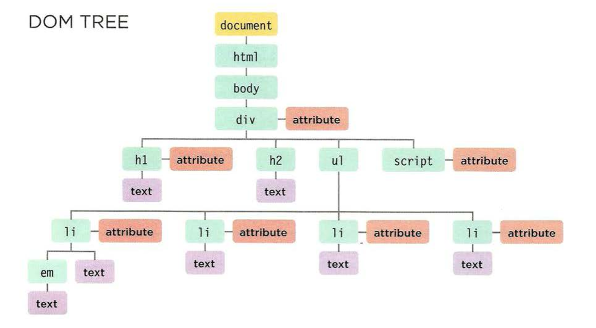

# JavaScript

## Object Literals

### What is an object ? 

Objects group together a set of variables and functions to create a model of a something you would recognize from the real world. In an object, variables and functions take on new names. If a variable is part of an object, it is called a property and If a function is part of an object, it is called a method which represent tasks that are associated with the object

***Note :In an object, that name is called a key. An object cannot have two keys with the same name. This is because keys are used to access their corresponding values.***

- Variables have a name and you can assign them a value of a string, number, or Boolean. 
- Arrays have a name and a group of values. (Each item in an array is a name/value pair because it has an index number and a value.) 
- Named functions have a name and value that is a set of statements to run if the function is called. • 
- Objects consist of a set of name/value pairs (but the names are referred to as keys). 

### How to access an object ?

```javascript

var variableName = objectName.propertyName;
var variableName = objectNmae['propertyNmae'];

var variableName = objectName.methodName;

```
ex :

 ```javascript

var hotel = { 
    name: 'Quay', 
    rooms: 40, 
    booked: 25, 
    checkAvailability: function() { 
        return this.rooms - this.booked; 
    } 
} ; 

```

## Document Object Model DOM

specifiey how browsers should create a model of an HTML page and how JavaScript can access and update the contents of a web page while it is in the browser window. it is a separate set of rules. It is implemented by all major browser makers, and covers two primary areas:

- Making a model of the html page 
- Accessing and changing html page 

## Dom tree

As a browser loads a web page, it creates a model of that page. The model is called a DOM tree, and it is stored in the browsers' memory. It consists of four main types of nodes, Each node is an object with methods and properties

- THE DOCUMENT NODE :it represents the entire page (and also corresponds to the document object,It is the starting point for all visits to the DOM tree.
- ELEMENT NODES 
- ATTRIBUTE NODES : are not children of the element thar carries them; they are part of that element
- TEXT NODES :  cannot have children. If an element contains text and another child element, the child element is not a child of the text node but rather a child of the containing element



### SELECT AN INDIVIDUAL ELEMENT NODE 

- get ElementByld () : Uses the value of an element's id attribute (which should be unique within the page
- querySe1ector () : Uses a CSS selector, and returns the first matching element

### SELECT MULTIPLE ELEMENT NODE

- getElementsByClassName() : Selects all elements that have a specific value for their cl ass attribute.
- getElementsByTagName() : Selects all elements that have the specified tag name
- querySelectorAll() : Uses a CSS selector to select all matching elements

### TRAVERSING BETWEEN ELEMENTS NODE

- parentNode : Selects the parent of the current element node (which will return just one element
- previousSibling / nextSibling : Selects the previous or next sibling from the DOM tree
- firstChild / lastChild : Select the first or last child of the current element

### ADDING AN ELEMENT TO THE DOM TREE 

```javascript

// Create a new element and store it in a variable. 
var newEl document.createElement( 'li '); 
// Create a text node and store it in a variable. 
var newText document.createTextNode( 'quinoa ' ); 
// Attach the new text node to the new element. 
newEl .appendChild(newText); 
// Find the position where the new element should be added. 
var position = document.getElementsByTagName('ul ')[O]; 
// Insert the new element into its posit ion . position.appendChi ld(newEl); 
position.appendChi ld(newEl);

```

### REMOVING AN ELEMENT FROM THE DOM TREE 

```javascript

var removeEl = document.getElementsByTagName('li ')[3]; // The element to remove 
var containerEl = removeEl .parentNode;     // Its containing element 
containerEl.removeChild(removeEl);   // Removing t he element 

```

### COMPARING TECHNIQUES: UPDATING HTML CONTENT 

element.innerHTML   |  
--------------------|---------------------------------------------------------------------------------------------------------
Advantges            | You can use it to add a lot of new markup using less code than DOM manipulation methods.
                    | It can be faster than DOM manipulation when adding a lot of new elements to a web page.
                    | It is a simple way to remove all of the content from one element 
disadvantages        | It should not be used to add content that has come from a user 
                    | It can be difficult to isolate single elements that you want to update within a larger DOM fragment.
                    | Event handlers may no longer work as intended 


Dom Manipulation    |
--------------------|------------------------------------------------------------------------------------------------           
Advantges           | It is suited to changing one element from a DOM fragment where there are many siblings. 
                    | It does not affect event handlers.
                    | It easily allows a script to add elements incrementally
disadvantages        | If you have to make a lot of changes to the content of a page, it is slower than innerHTML.  
                    | You need to write more code to achieve the same thing compared with innerHTML. 
